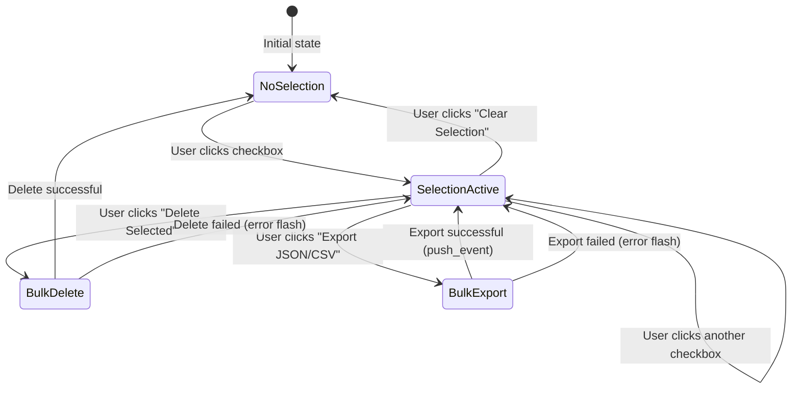
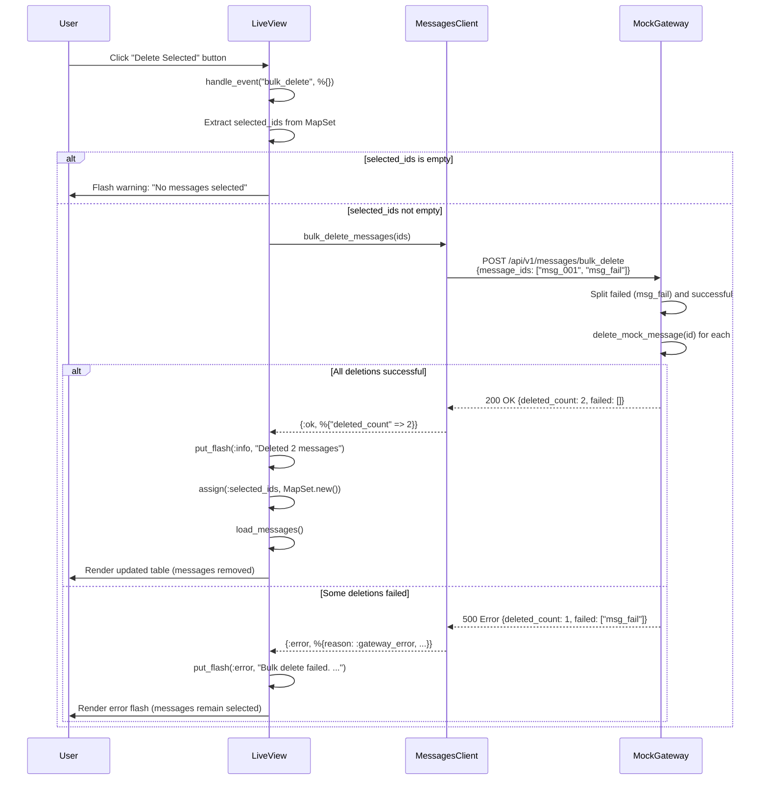
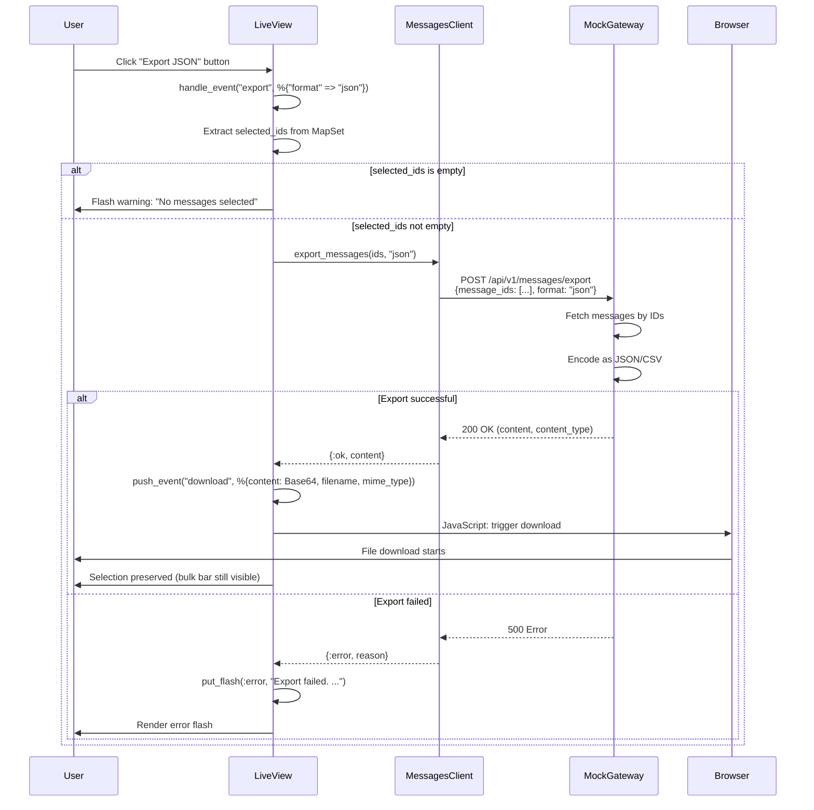
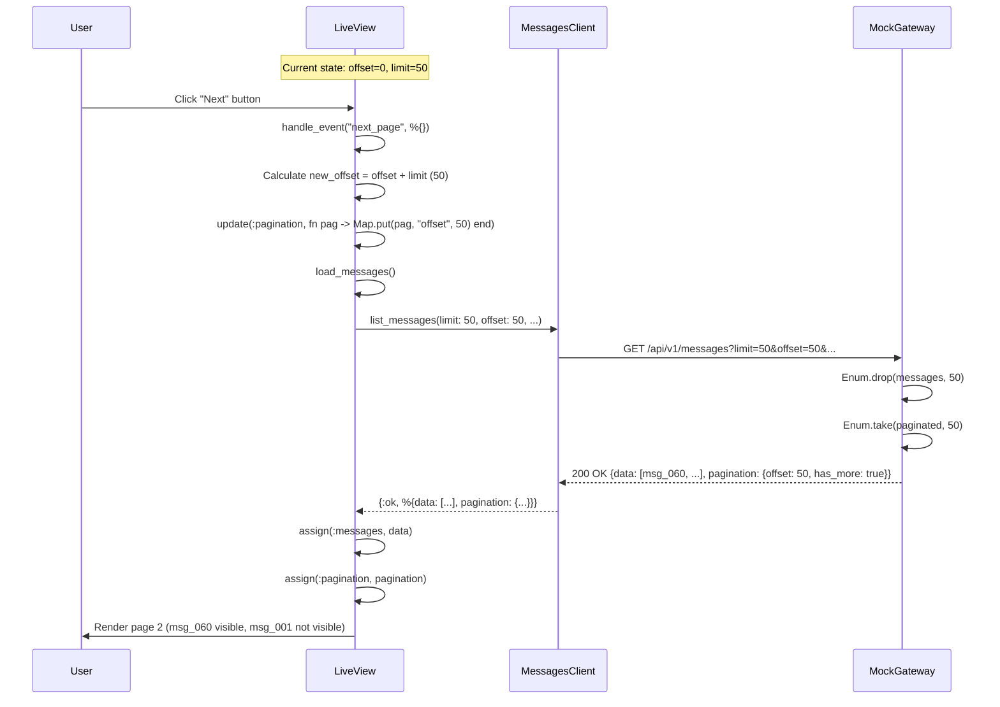
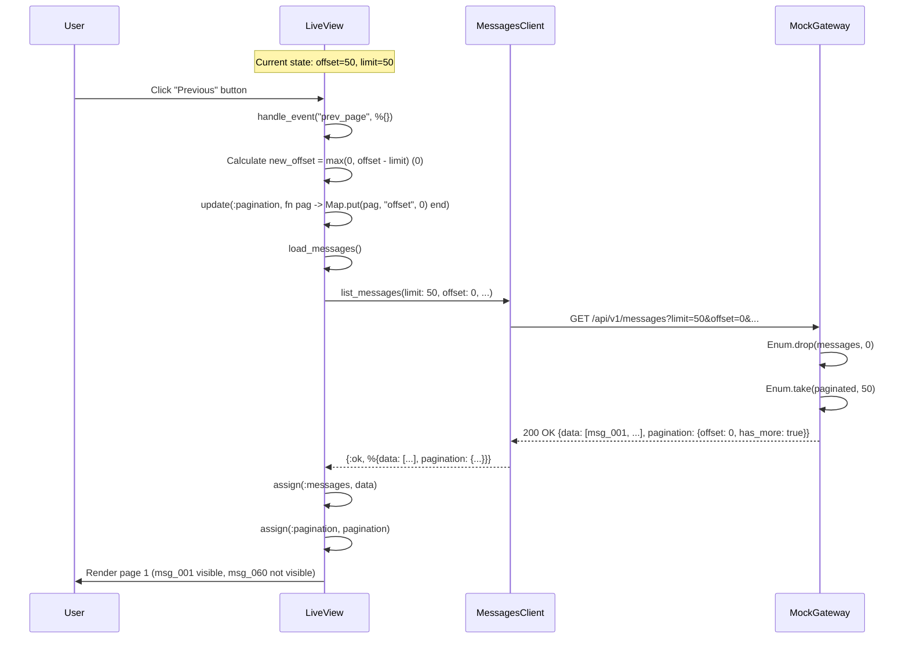
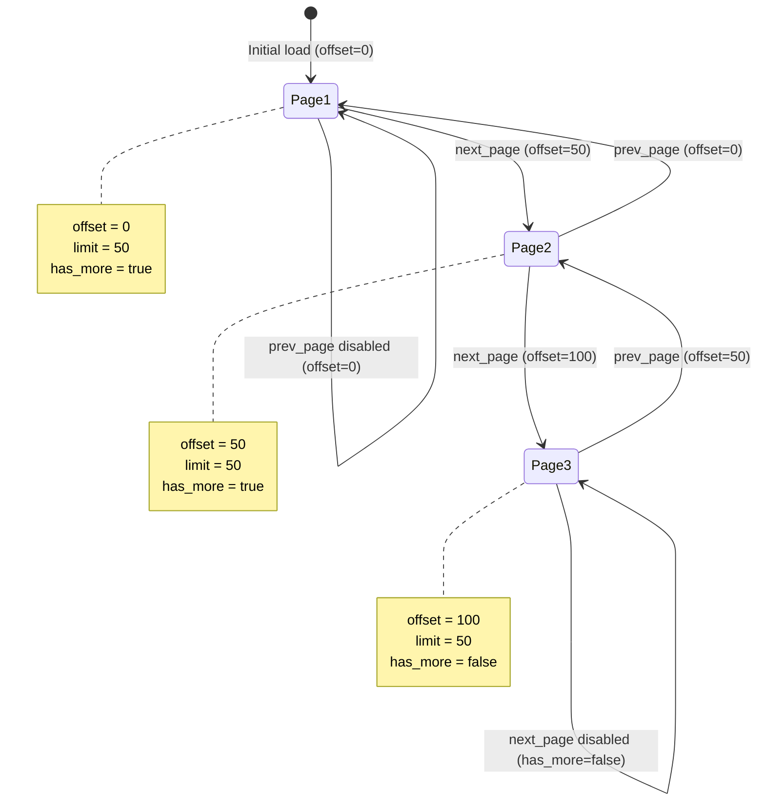
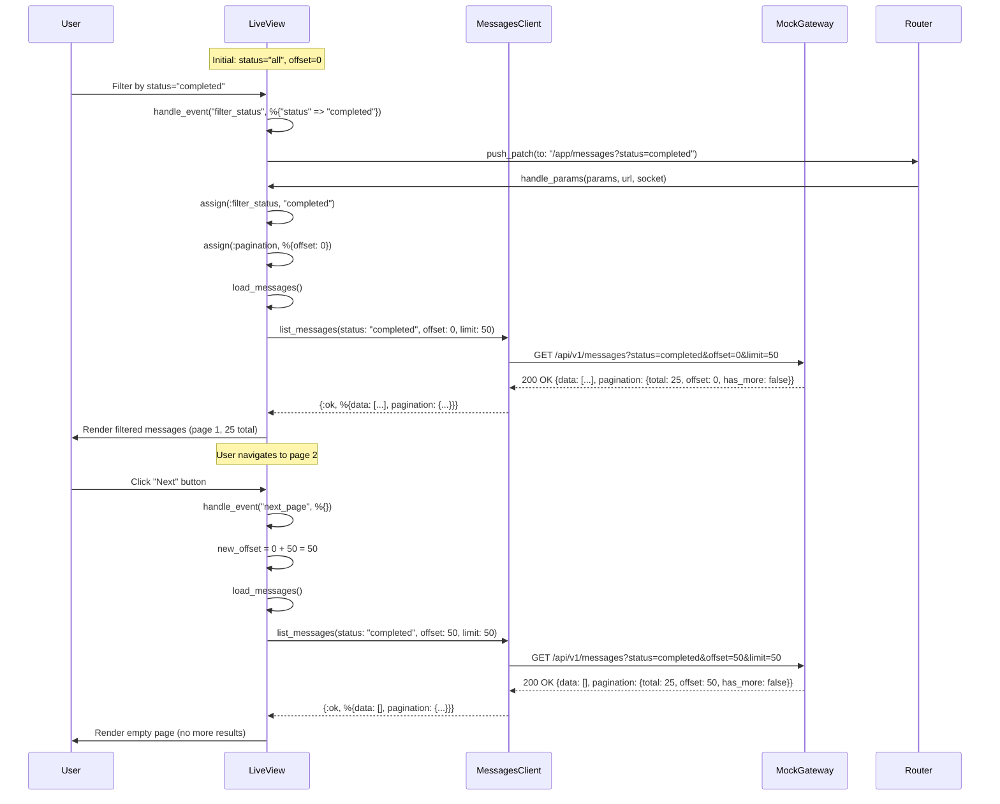
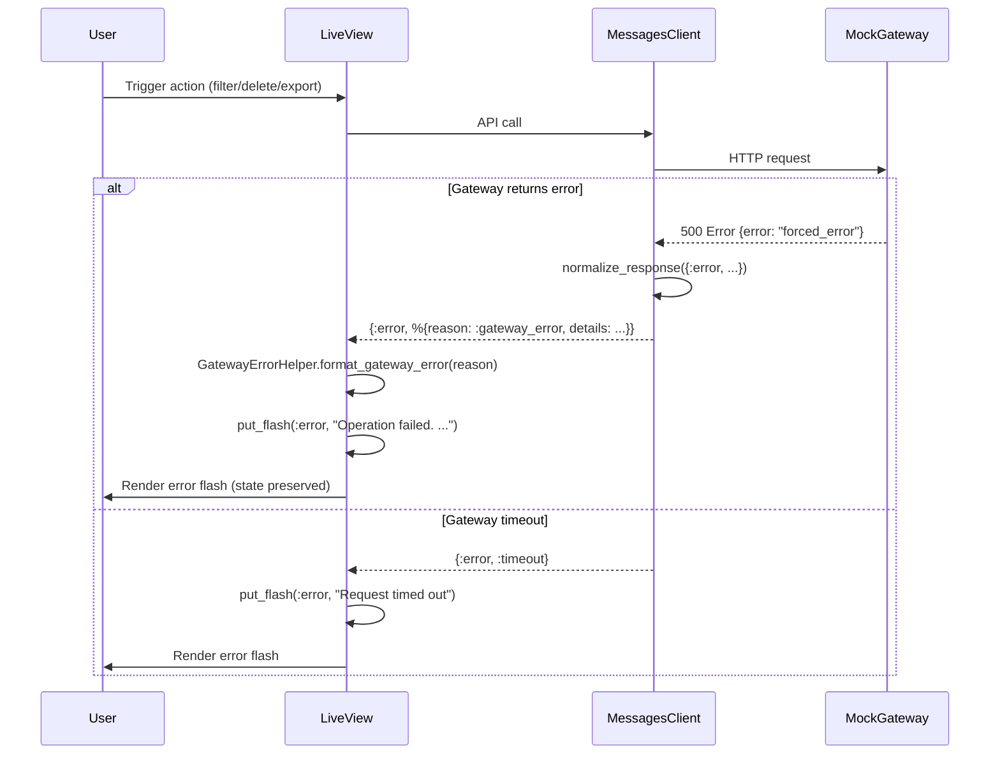

# MessagesLive.Index Event Flow Diagrams

This document describes the event flow diagrams for Filters, Bulk Actions, and Pagination in `MessagesLive.Index`.

## 1. Filter Flow

### 1.1. Filter by Status

```mermaid
sequenceDiagram
    participant User
    participant LiveView
    participant Router
    participant MessagesClient
    participant MockGateway

    User->>LiveView: Change <select name="status"> to "completed"
    LiveView->>LiveView: handle_event("filter_status", %{"status" => "completed"})
    LiveView->>Router: push_patch(to: "/app/messages?status=completed")
    Router->>LiveView: handle_params(params, url, socket)
    LiveView->>LiveView: assign(:filter_status, "completed")
    LiveView->>LiveView: load_messages()
    LiveView->>MessagesClient: list_messages(status: "completed", ...)
    MessagesClient->>MockGateway: GET /api/v1/messages?status=completed&limit=50&offset=0
    MockGateway->>MockGateway: filter_messages_by_status(messages, "completed")
    MockGateway-->>MessagesClient: 200 OK {data: [...], pagination: {...}}
    MessagesClient-->>LiveView: {:ok, %{data: [...], pagination: {...}}}
    LiveView->>LiveView: assign(:messages, data)
    LiveView->>LiveView: assign(:pagination, pagination)
    LiveView->>User: Render updated table with filtered messages
```

### 1.2. Filter by Type

```mermaid
sequenceDiagram
    participant User
    participant LiveView
    participant Router
    participant MessagesClient
    participant MockGateway

    User->>LiveView: Change <select name="type"> to "chat"
    LiveView->>LiveView: handle_event("filter_type", %{"type" => "chat"})
    LiveView->>Router: push_patch(to: "/app/messages?type=chat")
    Router->>LiveView: handle_params(params, url, socket)
    LiveView->>LiveView: assign(:filter_type, "chat")
    LiveView->>LiveView: load_messages()
    LiveView->>MessagesClient: list_messages(type: "chat", ...)
    MessagesClient->>MockGateway: GET /api/v1/messages?type=chat&limit=50&offset=0
    MockGateway->>MockGateway: filter_messages_by_type(messages, "chat")
    MockGateway-->>MessagesClient: 200 OK {data: [...], pagination: {...}}
    MessagesClient-->>LiveView: {:ok, %{data: [...], pagination: {...}}}
    LiveView->>LiveView: assign(:messages, data)
    LiveView->>User: Render updated table with filtered messages
```

## 2. Bulk Actions Flow

### 2.1. Selection Flow

### 2.2. Bulk Delete Flow

### 2.3. Export Flow

## 3. Pagination Flow

### 3.1. Next Page Flow

### 3.2. Previous Page Flow

### 3.3. Pagination State Machine

## 4. Combined Flow: Filter + Pagination

## 5. Error Handling Flow

### 5.1. Gateway Error Flow

## 6. State Transitions Summary

### 6.1. Filter State Transitions

| Event | From State | To State | Action |
|-------|-----------|----------|--------|
| `filter_status` | `{status: "all", ...}` | `{status: "completed", ...}` | `push_patch` → `handle_params` → `load_messages()` |
| `filter_type` | `{type: "all", ...}` | `{type: "chat", ...}` | `push_patch` → `handle_params` → `load_messages()` |
| `search` | `{search: "", ...}` | `{search: "query", ...}` | `push_patch` → `handle_params` → `load_messages()` |

### 6.2. Selection State Transitions

| Event | From State | To State | Action |
|-------|-----------|----------|--------|
| `toggle_select` | `selected_ids: MapSet.new()` | `selected_ids: MapSet.new(["msg_001"])` | Update assigns only |
| `select_all` | `selected_ids: MapSet.new()` | `selected_ids: MapSet.new([all_ids])` | Update assigns only |
| `deselect_all` | `selected_ids: MapSet.new([...])` | `selected_ids: MapSet.new()` | Update assigns only |
| `bulk_delete` (success) | `selected_ids: MapSet.new([...])` | `selected_ids: MapSet.new()` | Clear selection + reload messages |
| `bulk_delete` (error) | `selected_ids: MapSet.new([...])` | `selected_ids: MapSet.new([...])` | Preserve selection + show error |

### 6.3. Pagination State Transitions

| Event | From State | To State | Action |
|-------|-----------|----------|--------|
| `next_page` | `{offset: 0, limit: 50}` | `{offset: 50, limit: 50}` | Update pagination + `load_messages()` |
| `prev_page` | `{offset: 50, limit: 50}` | `{offset: 0, limit: 50}` | Update pagination + `load_messages()` |
| `filter_*` | `{offset: 50, ...}` | `{offset: 0, ...}` | Reset to page 1 + `load_messages()` |

## 7. Key Invariants

1. **Filter Invariant**: Changing filter always resets pagination to offset=0
2. **Selection Invariant**: Bulk actions preserve selection on error, clear on success
3. **Pagination Invariant**: `offset >= 0` and `offset % limit == 0` (always aligned to page boundaries)
4. **State Consistency**: All state changes trigger `load_messages()` to sync with backend
5. **Error Recovery**: Errors preserve current state (filters, selection, pagination) and show flash message

## 8. Testing Implications

### 8.1. Filter Tests
- Test that filter changes reset pagination
- Test that filter changes trigger `load_messages()`
- Test that URL params reflect filter state

### 8.2. Bulk Action Tests
- Test that selection state persists across renders
- Test that bulk_delete clears selection on success
- Test that bulk_delete preserves selection on error
- Test that export preserves selection

### 8.3. Pagination Tests
- Test that `next_page` increments offset by limit
- Test that `prev_page` decrements offset by limit (min 0)
- Test that pagination resets on filter change
- Test that disabled states work correctly (first/last page)

## References

- `apps/ui_web/lib/ui_web_web/live/messages_live/index.ex` - Implementation
- `apps/ui_web/test/ui_web_web/live/messages_live/index_test.exs` - Unit tests
- `apps/ui_web/test/support/mock_gateway.ex` - Mock Gateway implementation
- `apps/ui_web/docs/UI_WEB_TEST_STRATEGY.md` - Test strategy documentation

